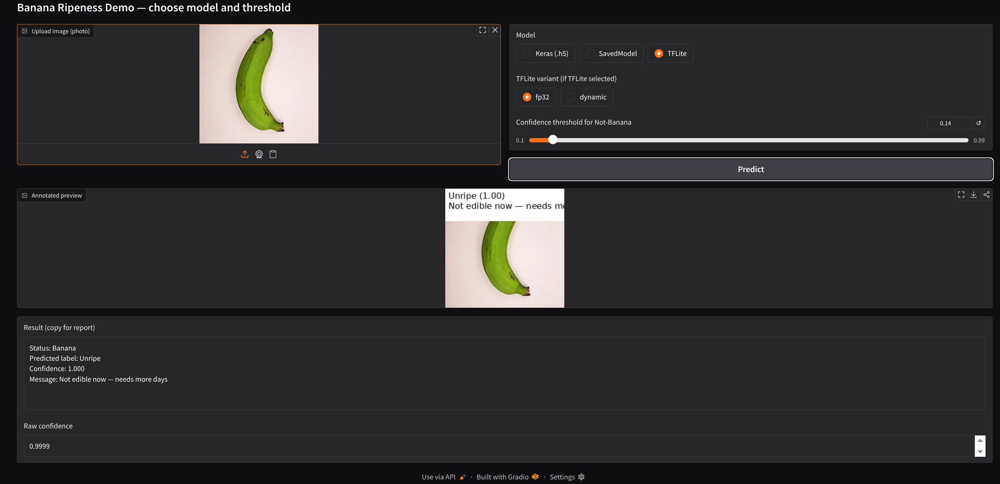

# 🍌 Banana Ripeness Classification using CNN

<p align="center">
  
</p>

<p align="center">
  <strong>Deep Learning–based Banana Ripeness Detection using Convolutional Neural Networks</strong>
</p>

<p align="center">
  
  
  
  
</p>

---

## 📌 Project Description

This project implements a **Convolutional Neural Network (CNN)** to automatically classify **banana ripeness stages** from images.  
The system learns visual features such as **color variation, texture, and surface patterns** to determine the maturity level of bananas.

---

## 🧠 Classification Categories

- Unripe  
- Half-ripened  
- Ripe  
- Overripe  

---

## 📂 Dataset Information

**Dataset Source:** Telkom University Dataverse  

🔗 https://dataverse.telkomuniversity.ac.id/file.xhtml?persistentId=doi:10.34820/FK2/GJBZ0X/7GJYWP&version=1.0  

⚠️ Dataset is not included in this repository due to large size (~70GB).

---

## 🛠 Technologies Used

- Python  
- TensorFlow / Keras  
- NumPy, Pandas  
- Matplotlib  
- Jupyter Notebook  

---

## 🧩 Model Architecture

- Convolution + MaxPooling layers  
- ReLU activation  
- Dropout for regularization  
- Dense layers  
- Softmax output  

---

## 🚀 How to Run

```bash
git clone https://github.com/Nihaal122/banana-ripeness-classification-cnn.git
cd banana-ripeness-classification-cnn
```

Install dependencies:
```bash
pip install -r requirements.txt
```

Run the notebook:
```bash
banana_full_project.ipynb
```

---

## 👤 Author

**Nihaal Khanna**

---

## 📚 References

- Telkom University Dataverse  
- TensorFlow Documentation  
